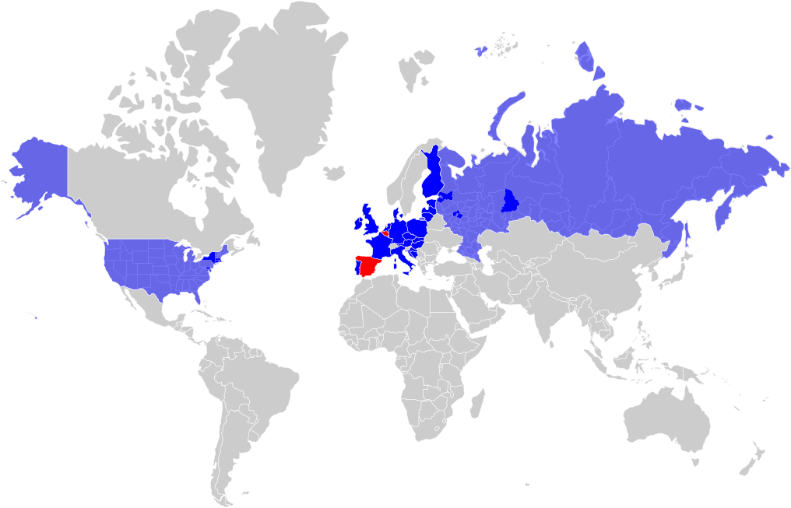

<h1 align="center">Hi, I'm Raúl Lázaro 👋</h1>

<h3 align="center">Senior FullStack Developer & Electronic Engineer</h3>

  <em>Entrepreneur, maker and technology lover. Always with a project in mind to keep learning.</em>

  <a href="https://raullazaro.com" target="_blank">🌐 Portfolio</a> •
  <a href="https://linkedin.com/in/raullazaro" target="_blank">💼 LinkedIn</a> •
  <a href="https://x.com/RaulLazaro_S" target="_blank">🐦 X</a> •
  <a href="mailto:contact@raullazaro.com">✉️ Contact</a>

---

### 🧑‍💻 About me

I'm an electronic engineer who fell in love with the web. After years of building things with my hands, 3D printers, electronics, even a 50-litre automated brewery, I found the same thrill writing software: taking an idea from sketch to something people actually use.

Today I work as a senior full-stack developer, comfortable from the browser down to the infrastructure. I care about clean interfaces, accessible design and code that is a pleasure to maintain.

When I'm not coding, I'm probably printing something, brewing a new recipe or planning the next trip.

---

### 🛠️ Tech stack

**Frontend**

**Backend**

**DevOps & Cloud**

**Other**

---

### 💼 Experience

| Period | Role | Company |
|--------|------|---------|
| Apr 2026 – present | **Senior FullStack** | Influencity |
| Apr 2023 – Apr 2026 | **Tech Engineer → Senior Tech Engineer** | Innusual |
| Apr 2022 – Nov 2022 | **Frontend Developer** | DEVO |
| Mar 2021 – Mar 2022 | **Software Engineer** | Alerion |
| Mar 2020 – Mar 2021 | **Frontend Developer** | BCN3D |
| 2017 | **Internship** | Divisa IT |

---

### 🚀 Featured projects

<table>
<tr>
<td width="50%">

#### [raullazaro-web](https://github.com/RaulLazaro/raullazaro-web)
My personal portfolio built with Astro 7, Tailwind CSS, and a custom WebGL shader. Features i18n (EN/ES), dark/light theme, and an interactive 3D travel globe.

`Astro` `TypeScript` `WebGL` `Tailwind`

</td>
<td width="50%">

#### [code-samples](https://github.com/RaulLazaro/code-samples)
A collection of anonymized technical challenge solutions, showcasing different approaches to common development problems.

`TypeScript` `React` `Node.js`

</td>
</tr>
<tr>
<td width="50%">

#### [dotfiles](https://github.com/RaulLazaro/dotfiles)
Personal development environment configuration managed with dotbot.

`Shell` `Git` `Neovim`

</td>
<td width="50%">

#### [hermes-infra](https://github.com/RaulLazaro/hermes-infra)
Infrastructure setup for personal AI agent tooling.

`AWS` `Terraform` `Shell`

</td>
</tr>
</table>

---

### 🌍 Travel

One of my passions is travelling. Here you can see all the places I have been.

  

  🔵 Visited &nbsp; 🔴 Lived

---

  

